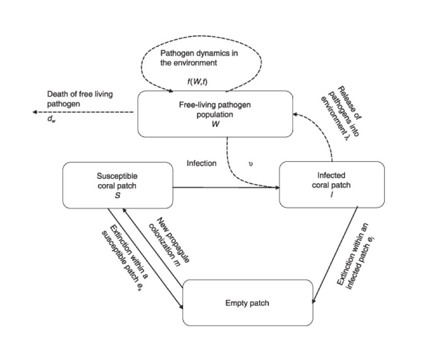

```{r setup, include=FALSE}
knitr::opts_chunk$set(echo = TRUE)
require(here)
```

# The model

Three core differential equations:

\begin{align}
\frac{d S}{dt} &= m (S + I) (1 - S - I) - e_s S - \nu W S \\
\newline
\frac{d I}{dt} &= \nu W S - e_i I
\newline
\newline
\frac{d W}{dt} &= \lambda I + f(W)
\newline
\end{align}

Where $f(W) = -d_w W$ : 

\begin{align}
\frac{d I}{dt} &= \frac{\nu \lambda}{d_w} I (C - I) - e_i I \\
\newline
\frac{d C}{dt} &= m C (1 - C) - e_s C + e_s I - e_i I
\end{align}


**Where variables are (quoted from Sokolow et al.):**

- $W$ = free-living pathogen population
- $S$ = susceptible coral patches (fraction out of a constant total number of patches in the network [susceptible + infected + empty])
- $I$ = infected coral patches (fraction out of a constant total number of patches in the network [susceptible + infected + empty])
- $C$ = colonized coral patches (fraction), where $C = S + I$

**Where parameters are (quoted from Table 1 and Table S1.1, Sokolow et al.):**

- $m$ = **colonization/connectivity term** encompassing coral fecundity within a patch (propagule generation) as well as propagule dispersal, settlement, and post-settlement survival. Set at 0.0002, which is equivalent to one complete colonization every ~15 years on average, which they think is reasonable plus or minus one order of magnitude depending on the species involved (Connell, Hughes, and Wallace, 1997 found that on average there was 17 years between periods of low and high coral recruitment after disturbance, corresponding to the presumed period required to return the habitat to its former favorable conditions)
- $e_s$ = **local extinction rates of susceptible (healthy) coral patches.** Set a 0.00001, which is equivalent to one extinction event in one healthy patch every ~300 years on average. The actual value is unknown but at equilibrium it's though that most available patches will be colonized by coral and will persist; this value allows an equilibrium saturation at ~95% of patches
- $e_i$ = **local extinction rates of infected coral patches** (it's assumed that $e_s$ < $e_i$). Set at 0.0005, which is equivalent to one extinction event (one diseases patch goes extinct) every ~5 years on average. $e_i$ likely changes significantly with disease. White plagues type II has a high lesion expansion rate, is though to be locally contagious, and is commonly lethal to host colonies within days to weeks so it is plausible that local patches of reef containing 10-1000 individuals could be driven to local extinction within several years
- $\nu$ = **transmission efficiency term** that represents the probability that a free-living pathogen will invade when it comes into contact with a susceptible patch of coral hosts, causing a local disease outbreak within a patch. Transmission probability is set at 0.00001, which is thought to reflect the low $\nu$ in the environment (due to strong coral immunological defense, large travel distances, etc.), although it is very difficult to measure directly. Note that the **force of infection** is calculated as $e^{- \nu W}$
- $\lambda$ = **rate at which infected hosts shed pathogens** into the environment or free-living pool. Set at 100, which is equivalent to an infected patch giving out ~100 viable infectious particles that could go out and infect new patches. This value was arbitrarily chosen, but biologically plausible as it encompasses multiplication rates of pathogen particles within a host and release of infectious particles upon host mortality or partial mortality
- $f(W)$ = **function governing the population dynamics of the free living pathogens** (in the simplest case explored, free-living particles undergo exponential decay where $f(W) = -d_w W$ with $\frac{1}{d_w}$ equal to average time that an infectious particle exists in the living environment). This simple case was also described analytically by a mathematical stability analysis
- $d_w$ = **average lifespan of an infectious particle** ($d_w$ = 0.01 = ~100 days; informed by (Anderson & May, 1981))




# Initial simulations

1. Set parameters and initial conditions 

```{r, message = FALSE, warning = FALSE}
# parameters
m <- 0.0002 # colonization term; varied from 0.00008 to 0.002
e_i <- 0.0005 # local extinction rates of infected coral patches; varied from 0.0001 to 0.005
e_s <- 0.00001 # local extinction rates of susceptible patches
d_w <- 0.01 # average lifespan of an infectious particle (100 days)
nu <- 0.00001 # transmission efficiency (i.e. pathogen will cause disease)
lambda <- 100 # rate at which hosts shed pathogens into the environment
H <- 5000 # total number of patches in the metapopulation

# Initial conditions
C0 <-  0.90 # initial percent colonized patches
S0 <-  0.90 # initial percent susceptible patches
I0 <- 0.0 # initial fraction of infected patches
W0 <- 100 # initial number of free living infectious particles

```

2. Create holding and time vectors with initial conditions

```{r}
tset <- seq(from = 0, to = 50*365, by = 1) # ~50 years
S.simu1 <- NaN*tset
  S.simu1[1] <- S0
I.simu1 <- NaN*tset
  I.simu1[1] <- I0
W.simu1 <- NaN*tset
  W.simu1[1] <- W0
C.simu1 <- NaN*tset
  C.simu1[1] <- C0
  
```

3. Create sub-functions

```{r}
# determines force of infection
foi <- function(nu, W) {
  return(1 - exp(-nu*W))
}

# creates demographic stochasticity for coral patches (that are fractions)
newfraction <- function(x) {
  n <- rpois(n = 1, lambda = H*x) # H is the total number of patches in the metapopulation (set to 5,000 for their simulations)
  # this takes a single (n=1) random draw from a poisson distribution with a mean and variance lambda (the fraction of patches occupied at the previous step)
  new_x <- min(n/H, 1)
  ifelse(n < 3, 
         return(new_x),
                return(x)) # when the population is small (fewer than three patches)
}
  
# stochasticity for the pathogen for when it has fewer than three pathogen particles
new <- function(new_W) {
  ifelse(new_W < 3,
         return(rpois(n = 1, lambda = new_W)), 
                return(new_W))
}

```


4. Simulate the model

```{r}
for(i in 2:length(tset)){
  # calculate the change in time
  dt <- tset[i] - tset[i-1]
  
  # store temporary variables
  S <- S.simu1[i-1]
  I <- I.simu1[i-1]
  W <- W.simu1[i-1]
  C <- C.simu1[i-1]
  
  # calculate change in state variables
  dS <- ( m*(S + I)*(1 - S - I) - (e_s*S) - (nu*W*S) )
  dI <- ( nu*W*S - (e_i*I) )
  dW <- ( lambda*I - (d_w*W) )
  dC <- (m*C*(1-C) - e_s*C + e_s*I - e_i*I)
  
  # calculate add change to previous time step
  # and store in the holding vector
  S.simu1[i] <- newfraction(S.simu1[i-1] + dS)
  I.simu1[i] <- newfraction(I.simu1[i-1] + dI)
  W.simu1[i] <- new(W.simu1[i-1] + dW)
  C.simu1[i] <- C.simu1[i-1] + (S.simu1[i]-S.simu1[i-1]) + (I.simu1[i]-I.simu1[i-1]) # I made this up--I think it should be the previous C plus the change in S and the change in I since C = S + I? Alternatively, use the supplemental equation for dC/dt (although when I tried it that didn't work..)
  
}
```

4. Plot results as a time series

```{r}
# store colors for consistency
Scol <- "#40d3bb"
Icol <- "#b64709"
Ccol <- "#fcd300"
Wcol <- "#3d7dc5"

```

```{r}
# plot fraction susceptible against time (tset) for the first 12 years (to match figure 6)
plot(x = tset[1:4380], y = S.simu1[1:4380],
     type = 'l', las = 1, lwd = 2, col = Scol,
     xlab = 'Time', ylab = 'Fraction of coral patches',
     ylim = c(0, 1))

# plot fraction of patches colonized against time (tset)
lines(x = tset[1:4380], y = C.simu1[1:4380],
      lwd = 2, col = Ccol)

# plot fraction infected against time (tset)
lines(x = tset[1:4380], y = I.simu1[1:4380],
      lwd = 2, col = Icol)

# abline(v = 365, lty = 2) # year 1
abline(v = tset[which(I.simu1 == max(I.simu1))], lty = 2) # line at maximum (within first year (day = 269)), where susceptible has dropped to 0.007 (0.7%)


# add a legend
legend(x = 1000, y = 0.9, 
       lwd = 2,
       legend = c('Susceptible', 'Infected', 'Colonized'),
       col = c(Scol, Icol, Ccol))
```

# Bifurcation diagrams

## Wrt nu (transmission efficiency)

We'd expect this to increase with temperature or coralliovre interactions. 

### How I'd run it if I hadn't seen their code:

```{r}
# create range of nu values to plot over
Nuset <- seq(from = 0.0000001, to = 0.999999,length.out = 100)

# make sure parameters are still correct
m <- 0.0002 
e_i <- 0.0005 
e_s <- 0.00001 
d_w <- 0.01 
lambda <- 100 
H <- 5000 

# we'll do this over a shorter time 
tset <- seq(from = 0, to = 20*365, by = 1) # ~20 years

# create storage vectors
Sstarset <- NaN*Nuset
Istarset <- NaN*Nuset
Wstarset <- NaN*Nuset
Cstarset <- NaN*Nuset


# get equilibrium values
for(j in 1:length(Nuset)){
  # assign the value of nu
	nu <- Nuset[j] 
	
	# create a holding vector for patch metapopulations
	# and fill with initial conditions
	S.simu <- NaN*tset
	S.simu[1] <- S0  
	I.simu <- NaN*tset
	I.simu[1] <- I0
	W.simu <- NaN*tset 
	W.simu[1] <- W0
	C.simu <- NaN*tset
	C.simu[1] <- C0
	
	for(i in 2:length(tset)){
	  # calculate the change in time
    dt <- tset[i] - tset[i-1]
    
    # store temporary variables
    S <- S.simu[i-1]
    I <- I.simu[i-1]
    W <- W.simu[i-1]
    C <- C.simu[i-1]
    
    # calculate change in state variables
    dS <- ( m*(S + I)*(1 - S - I) - (e_s*S) - (nu*W*S) )
    dI <- ( nu*W*S - (e_i*I) )
    dW <- ( lambda*I - (d_w*W) ) # note f(W) = d_w*W in this simple case
    
    
    # calculate add change to previous time step
    # and store in the holding vector
    S.simu[i] <- S.simu[i-1] + dS
    I.simu[i] <- I.simu[i-1] + dI
    W.simu[i] <- W.simu[i-1] + dW
    C.simu[i] <- S.simu[i] + I.simu[i]

    
	}
	
	# storing last population size (equilibrium population size) in holding vector
	Sstarset[j] <- S.simu[length(tset)]
	Istarset[j] <- I.simu[length(tset)]
	Wstarset[j] <- W.simu[length(tset)]
	Cstarset[j] <- C.simu[length(tset)]
	
	# print progress
	ifelse(j %% 20 == 0, print(paste("Progress: on nu = ", j, sep = "")), NA)
}

```

The plots don't look like anything because after the inital value all the values are NA's (e.g. Istarset is: `r head(Istarset)`). 

```{r}
# plot stable equilibria of infected (Istarset) against transmission efficiency (nu)
plot(x = Nuset, y = Istarset,
     type = 'l', lwd = 2, col = Icol, las = 1,
     xlab = 'Transmission efficiency, nu', ylab = 'Stable equilibria of infected corals, I*')

# plot stable equilibria of prey (Xstarset) against density of alternate prey (Yset)
plot(x = Nuset, y = Sstarset,
     type = 'l', lwd = 2, col = Scol, las = 1, 
     xlab = 'Transmission efficiency, nu', ylab = 'Stable equilibria of susceptible corals, S*')
```

## Try re-doing it with the modifications they used in their code:

In their code they made some changes that I didn't see explained fully in their paper (although I might just not have understood). They:

1. Create a newfraction() function that "implements demographic stochasticity" when there are only a few coral patches (fewer than 3). In newfraction() they take the number of Susceptible/Infected patches and generate a random number from a Poisson distribution with a mean/variance equal to the number of patches that are susceptible or infected. They then divide that random number by the total number of available patches and, if it's less than 1 that becomes the S or I. If it is greater than I then S or I is equal to 1. 

2. They implement a new() function for the number of pathogen particles when that number is low (<3 particles). It also uses the function `rpois`, which draws a random number from the Poisson distribution with a mean/variance equal to the number of pathogen particles. 

3. They substitute instances of $\nu W$ for an equation detailing the force of infection "FOI", which is described by the equation $foi = 1 - e^{-\nu W}$. I don't think they mention foi in the paper and I'm not sure how/why it is equal to $\nu W$. In the first appendix they do say that $\nu$ determines "the force of infection, calculated as $e^{-\nu W}$, where $W$ is the number of free-living infectious particles and $\nu$ is a transmission probability. 

4. They have a conditional statement that says if the number of colonized patches, $C$ or $S + I$, is greater than 1, the $S = 1 - I$, which is confusing. How could there be more than 100% of patches colonized and why would that mean that the fraction of susceptible patches is now $1 - I$?

```{r}
# create range of nu values to plot over
Nuset <- seq(from = 0.0000001, to = 0.999999,length.out = 100)

# make sure parameters are still correct
m <- 0.0002 
e_i <- 0.0005 
e_s <- 0.00001 
d_w <- 0.01 
lambda <- 100 
H <- 5000 

# we'll do this over a shorter time 
tset <- seq(from = 0, to = 20*365, by = 1) # ~20 years

# create storage vectors
Sstarset <- NaN*Nuset
Istarset <- NaN*Nuset
Wstarset <- NaN*Nuset
Cstarset <- NaN*Nuset


# get equilibrium values
for(j in 1:length(Nuset)){
  # assign the value of nu
	nu <- Nuset[j] 
	
	# create a holding vector for patch metapopulations
	# and fill with initial conditions
	S.simu <- NaN*tset
	S.simu[1] <- S0  
	I.simu <- NaN*tset
	I.simu[1] <- I0
	W.simu <- NaN*tset 
	W.simu[1] <- W0
	C.simu <- NaN*tset
	C.simu[1] <- C0
	
	for(i in 2:length(tset)){
	  # calculate the change in time
    dt <- tset[i] - tset[i-1]
    
    # store temporary variables
    S <- S.simu[i-1]
    I <- I.simu[i-1]
    W <- W.simu[i-1]
    C <- C.simu[i-1]
    force <- foi(nu = nu, W = W)
    
    # calculate change in state variables
    dS <- ( m*(S + I)*(1 - I - S) - (e_s*S) - (force*S) )
    dI <- ( force*S - (e_i*I) )
    dW <- ( lambda*I - (d_w*W) )
    
    
    # calculate add change to previous time step
    # and store in the holding vector
    S.simu[i] <- newfraction(S.simu[i-1] + dS)
    I.simu[i] <- newfraction(I.simu[i-1] + dI)
    W.simu[i] <- new(W.simu[i-1] + dW)
    C.simu[i] <- S.simu[i] + I.simu[i]
    ifelse(C.simu[i] > 1,
           S.simu[i] <- 1-I.simu[i],
           NA)
      
	}
	
	# storing last population size (equilibrium population size) in holding vector
	Sstarset[j] <- S.simu[length(tset)]
	Istarset[j] <- I.simu[length(tset)]
	Wstarset[j] <- W.simu[length(tset)]
	Cstarset[j] <- C.simu[length(tset)]
	
	# print progress
	ifelse(j %% 20 == 0, print(paste("Progress: on nu = ", j, sep = "")), NA)
}

```

Plot it

```{r}
# plot stable equilibria of infected (Istarset) against transmission efficiency (nu)
plot(x = Nuset, y = Istarset,
     type = 'l', lwd = 2, col = Icol, las = 1,
     xlab = 'Transmission efficiency, nu', ylab = 'Stable equilibria of infected corals, I*')

# plot stable equilibria of prey (Xstarset) against density of alternate prey (Yset)
plot(x = Nuset, y = Sstarset,
     type = 'l', lwd = 2, col = Scol, las = 1, 
     xlab = 'Transmission efficiency, nu', ylab = 'Stable equilibria of susceptible corals, S*')
```

I'm not sure I understand these plots--why is I* so low (peaks at 7%?) and why does S* have no stochasticity like I*?

### Run it with just one change (demographic stochasticity)

```{r}
# create range of nu values to plot over
Nuset <- seq(from = 0.0000001, to = 0.999999,length.out = 100)

# make sure parameters are still correct
m <- 0.0002 
e_i <- 0.0005 
e_s <- 0.00001 
d_w <- 0.01 
lambda <- 100 
H <- 5000 

# we'll do this over a shorter time 
tset <- seq(from = 0, to = 20*365, by = 1) # ~20 years

# create storage vectors
Sstarset <- NaN*Nuset
Istarset <- NaN*Nuset
Wstarset <- NaN*Nuset
Cstarset <- NaN*Nuset


# get equilibrium values
for(j in 1:length(Nuset)){
  # assign the value of nu
	nu <- Nuset[j] 
	
	# create a holding vector for patch metapopulations
	# and fill with initial conditions
	S.simu <- NaN*tset
	S.simu[1] <- S0  
	I.simu <- NaN*tset
	I.simu[1] <- I0
	W.simu <- NaN*tset 
	W.simu[1] <- W0
	C.simu <- NaN*tset
	C.simu[1] <- C0
	
	for(i in 2:length(tset)){
	  # calculate the change in time
    dt <- tset[i] - tset[i-1]
    
    # store temporary variables
    S <- S.simu[i-1]
    I <- I.simu[i-1]
    W <- W.simu[i-1]
    C <- C.simu[i-1]
    # force <- foi(nu = nu, W = W)
    
    # calculate change in state variables
    dS <- ( m*(S + I)*(1 - I - S) - (e_s*S) - (nu*W*S) )
    dI <- ( nu*W*S - (e_i*I) )
    dW <- ( lambda*I - (d_w*W) )
    
    
    # calculate add change to previous time step
    # and store in the holding vector
    S.simu[i] <- newfraction(S.simu[i-1] + dS)
    I.simu[i] <- newfraction(I.simu[i-1] + dI)
    W.simu[i] <- new(W.simu[i-1] + dW)
    C.simu[i] <- S.simu[i] + I.simu[i]
    # ifelse(C.simu[i] > 1,
    #        S.simu[i] <- 1-I.simu[i],
    #        NA)
      
	}
	
	# storing last population size (equilibrium population size) in holding vector
	Sstarset[j] <- S.simu[length(tset)]
	Istarset[j] <- I.simu[length(tset)]
	Wstarset[j] <- W.simu[length(tset)]
	Cstarset[j] <- C.simu[length(tset)]
	
	# print progress
	ifelse(j %% 20 == 0, print(paste("Progress: on nu = ", j, sep = "")), NA)
}

```

Plot it: Get `NA` values again

```{r}
# plot stable equilibria of infected (Istarset) against transmission efficiency (nu)
plot(x = Nuset, y = Istarset,
     type = 'l', lwd = 2, col = Icol, las = 1,
     xlab = 'Transmission efficiency, nu', ylab = 'Stable equilibria of infected corals, I*')

# plot stable equilibria of prey (Xstarset) against density of alternate prey (Yset)
plot(x = Nuset, y = Sstarset,
     type = 'l', lwd = 2, col = Scol, las = 1, 
     xlab = 'Transmission efficiency, nu', ylab = 'Stable equilibria of susceptible corals, S*')
```

### Run it with just one change (C > 1, S = 1-I rule)

```{r}
# create range of nu values to plot over
Nuset <- seq(from = 0.0000001, to = 0.999999,length.out = 100)

# make sure parameters are still correct
m <- 0.0002 
e_i <- 0.0005 
e_s <- 0.00001 
d_w <- 0.01 
lambda <- 100 
H <- 5000 

# we'll do this over a shorter time 
tset <- seq(from = 0, to = 20*365, by = 1) # ~20 years

# create storage vectors
Sstarset <- NaN*Nuset
Istarset <- NaN*Nuset
Wstarset <- NaN*Nuset
Cstarset <- NaN*Nuset


# get equilibrium values
for(j in 1:length(Nuset)){
  # assign the value of nu
	nu <- Nuset[j] 
	
	# create a holding vector for patch metapopulations
	# and fill with initial conditions
	S.simu <- NaN*tset
	S.simu[1] <- S0  
	I.simu <- NaN*tset
	I.simu[1] <- I0
	W.simu <- NaN*tset 
	W.simu[1] <- W0
	C.simu <- NaN*tset
	C.simu[1] <- C0
	
	for(i in 2:length(tset)){
	  # calculate the change in time
    dt <- tset[i] - tset[i-1]
    
    # store temporary variables
    S <- S.simu[i-1]
    I <- I.simu[i-1]
    W <- W.simu[i-1]
    C <- C.simu[i-1]
    # force <- foi(nu = nu, W = W)
    
    # calculate change in state variables
    dS <- ( m*(S + I)*(1 - I - S) - (e_s*S) - (nu*W*S) )
    dI <- ( nu*W*S - (e_i*I) )
    dW <- ( lambda*I - (d_w*W) )
    
    
    # calculate add change to previous time step
    # and store in the holding vector
    S.simu[i] <- (S.simu[i-1] + dS)
    I.simu[i] <- (I.simu[i-1] + dI)
    W.simu[i] <- (W.simu[i-1] + dW)
    C.simu[i] <- S.simu[i] + I.simu[i]
    ifelse(C.simu[i] > 1,
           S.simu[i] <- 1-I.simu[i],
           NA)
      
	}
	
	# storing last population size (equilibrium population size) in holding vector
	Sstarset[j] <- S.simu[length(tset)]
	Istarset[j] <- I.simu[length(tset)]
	Wstarset[j] <- W.simu[length(tset)]
	Cstarset[j] <- C.simu[length(tset)]
	
	# print progress
	ifelse(j %% 20 == 0, print(paste("Progress: on nu = ", j, sep = "")), NA)
}

```

Plot it: `NA` values again

```{r}
# plot stable equilibria of infected (Istarset) against transmission efficiency (nu)
plot(x = Nuset, y = Istarset,
     type = 'l', lwd = 2, col = Icol, las = 1,
     xlab = 'Transmission efficiency, nu', ylab = 'Stable equilibria of infected corals, I*')

# plot stable equilibria of prey (Xstarset) against density of alternate prey (Yset)
plot(x = Nuset, y = Sstarset,
     type = 'l', lwd = 2, col = Scol, las = 1, 
     xlab = 'Transmission efficiency, nu', ylab = 'Stable equilibria of susceptible corals, S*')
```

### Run it with just one change (FOI = vW)

```{r}
# create range of nu values to plot over
Nuset <- seq(from = 0.0000001, to = 0.999999,length.out = 100)

# make sure parameters are still correct
m <- 0.0002 
e_i <- 0.0005 
e_s <- 0.00001 
d_w <- 0.01 
lambda <- 100 
H <- 5000 

# we'll do this over a shorter time 
tset <- seq(from = 0, to = 20*365, by = 1) # ~20 years

# create storage vectors
Sstarset <- NaN*Nuset
Istarset <- NaN*Nuset
Wstarset <- NaN*Nuset
Cstarset <- NaN*Nuset


# get equilibrium values
for(j in 1:length(Nuset)){
  # assign the value of nu
	nu <- Nuset[j] 
	
	# create a holding vector for patch metapopulations
	# and fill with initial conditions
	S.simu <- NaN*tset
	S.simu[1] <- S0  
	I.simu <- NaN*tset
	I.simu[1] <- I0
	W.simu <- NaN*tset 
	W.simu[1] <- W0
	C.simu <- NaN*tset
	C.simu[1] <- C0
	
	for(i in 2:length(tset)){
	  # calculate the change in time
    dt <- tset[i] - tset[i-1]
    
    # store temporary variables
    S <- S.simu[i-1]
    I <- I.simu[i-1]
    W <- W.simu[i-1]
    C <- C.simu[i-1]
    force <- foi(nu = nu, W = W)
    
    # calculate change in state variables
    dS <- ( m*(S + I)*(1 - I - S) - (e_s*S) - (force*S) )
    dI <- ( force*S - (e_i*I) )
    dW <- ( lambda*I - (d_w*W) )
    
    
    # calculate add change to previous time step
    # and store in the holding vector
    S.simu[i] <- (S.simu[i-1] + dS)
    I.simu[i] <- (I.simu[i-1] + dI)
    W.simu[i] <- (W.simu[i-1] + dW)
    C.simu[i] <- S.simu[i] + I.simu[i]
    # ifelse(C.simu[i] > 1,
    #        S.simu[i] <- 1-I.simu[i],
    #        NA)
      
	}
	
	# storing last population size (equilibrium population size) in holding vector
	Sstarset[j] <- S.simu[length(tset)]
	Istarset[j] <- I.simu[length(tset)]
	Wstarset[j] <- W.simu[length(tset)]
	Cstarset[j] <- C.simu[length(tset)]
	
	# print progress
	ifelse(j %% 20 == 0, print(paste("Progress: on nu = ", j, sep = "")), NA)
}

```

Plot it: see there's no stochasticity but I* values still seem really low

```{r}
# plot stable equilibria of infected (Istarset) against transmission efficiency (nu)
plot(x = Nuset, y = Istarset,
     type = 'l', lwd = 2, col = Icol, las = 1,
     xlab = 'Transmission efficiency, nu', ylab = 'Stable equilibria of infected corals, I*')

# plot stable equilibria of prey (Xstarset) against density of alternate prey (Yset)
plot(x = Nuset, y = Sstarset,
     type = 'l', lwd = 2, col = Scol, las = 1, 
     xlab = 'Transmission efficiency, nu', ylab = 'Stable equilibria of susceptible corals, S*')
```

### Run it with two changes (FOI = vW & C > 1 rule)

Now I'll start building off of the one alteration that didn't result in `NA` values (FOI = vW) by adding in one change at a time to look at each one's effect.

```{r}
# create range of nu values to plot over
Nuset <- seq(from = 0.0000001, to = 0.999999,length.out = 100)

# make sure parameters are still correct
m <- 0.0002 
e_i <- 0.0005 
e_s <- 0.00001 
d_w <- 0.01 
lambda <- 100 
H <- 5000 

# we'll do this over a shorter time 
tset <- seq(from = 0, to = 20*365, by = 1) # ~20 years

# create storage vectors
Sstarset <- NaN*Nuset
Istarset <- NaN*Nuset
Wstarset <- NaN*Nuset
Cstarset <- NaN*Nuset


# get equilibrium values
for(j in 1:length(Nuset)){
  # assign the value of nu
	nu <- Nuset[j] 
	
	# create a holding vector for patch metapopulations
	# and fill with initial conditions
	S.simu <- NaN*tset
	S.simu[1] <- S0  
	I.simu <- NaN*tset
	I.simu[1] <- I0
	W.simu <- NaN*tset 
	W.simu[1] <- W0
	C.simu <- NaN*tset
	C.simu[1] <- C0
	
	for(i in 2:length(tset)){
	  # calculate the change in time
    dt <- tset[i] - tset[i-1]
    
    # store temporary variables
    S <- S.simu[i-1]
    I <- I.simu[i-1]
    W <- W.simu[i-1]
    C <- C.simu[i-1]
    force <- foi(nu = nu, W = W)
    
    # calculate change in state variables
    dS <- ( m*(S + I)*(1 - I - S) - (e_s*S) - (force*S) )
    dI <- ( force*S - (e_i*I) )
    dW <- ( lambda*I - (d_w*W) )
    
    
    # calculate add change to previous time step
    # and store in the holding vector
    S.simu[i] <- (S.simu[i-1] + dS)
    I.simu[i] <- (I.simu[i-1] + dI)
    W.simu[i] <- (W.simu[i-1] + dW)
    C.simu[i] <- S.simu[i] + I.simu[i]
    ifelse(C.simu[i] > 1,
            S.simu[i] <- 1-I.simu[i],
            NA)
      
	}
	
	# storing last population size (equilibrium population size) in holding vector
	Sstarset[j] <- S.simu[length(tset)]
	Istarset[j] <- I.simu[length(tset)]
	Wstarset[j] <- W.simu[length(tset)]
	Cstarset[j] <- C.simu[length(tset)]
	
	# print progress
	ifelse(j %% 20 == 0, print(paste("Progress: on nu = ", j, sep = "")), NA)
}

```

Plot it: no clear difference here

```{r}
# plot stable equilibria of infected (Istarset) against transmission efficiency (nu)
plot(x = Nuset, y = Istarset,
     type = 'l', lwd = 2, col = Icol, las = 1,
     xlab = 'Transmission efficiency, nu', ylab = 'Stable equilibria of infected corals, I*')

# plot stable equilibria of prey (Xstarset) against density of alternate prey (Yset)
plot(x = Nuset, y = Sstarset,
     type = 'l', lwd = 2, col = Scol, las = 1, 
     xlab = 'Transmission efficiency, nu', ylab = 'Stable equilibria of susceptible corals, S*')
```

### Run it with two changes (FOI = vW & stochasticity)

Note the C > 1 alteration is not in effect

```{r}
# create range of nu values to plot over
Nuset <- seq(from = 0.0000001, to = 0.999999,length.out = 100)

# make sure parameters are still correct
m <- 0.0002 
e_i <- 0.0005 
e_s <- 0.00001 
d_w <- 0.01 
lambda <- 100 
H <- 5000 

# we'll do this over a shorter time 
tset <- seq(from = 0, to = 20*365, by = 1) # ~20 years

# create storage vectors
Sstarset <- NaN*Nuset
Istarset <- NaN*Nuset
Wstarset <- NaN*Nuset
Cstarset <- NaN*Nuset


# get equilibrium values
for(j in 1:length(Nuset)){
  # assign the value of nu
	nu <- Nuset[j] 
	
	# create a holding vector for patch metapopulations
	# and fill with initial conditions
	S.simu <- NaN*tset
	S.simu[1] <- S0  
	I.simu <- NaN*tset
	I.simu[1] <- I0
	W.simu <- NaN*tset 
	W.simu[1] <- W0
	C.simu <- NaN*tset
	C.simu[1] <- C0
	
	for(i in 2:length(tset)){
	  # calculate the change in time
    dt <- tset[i] - tset[i-1]
    
    # store temporary variables
    S <- S.simu[i-1]
    I <- I.simu[i-1]
    W <- W.simu[i-1]
    C <- C.simu[i-1]
    force <- foi(nu = nu, W = W)
    
    # calculate change in state variables
    dS <- ( m*(S + I)*(1 - I - S) - (e_s*S) - (force*S) )
    dI <- ( force*S - (e_i*I) )
    dW <- ( lambda*I - (d_w*W) )
    
    
    # calculate add change to previous time step
    # and store in the holding vector
    S.simu[i] <- newfraction(S.simu[i-1] + dS)
    I.simu[i] <- newfraction(I.simu[i-1] + dI)
    W.simu[i] <- new(W.simu[i-1] + dW)
    C.simu[i] <- S.simu[i] + I.simu[i]
    # ifelse(C.simu[i] > 1,
    #         S.simu[i] <- 1-I.simu[i],
    #         NA)
      
	}
	
	# storing last population size (equilibrium population size) in holding vector
	Sstarset[j] <- S.simu[length(tset)]
	Istarset[j] <- I.simu[length(tset)]
	Wstarset[j] <- W.simu[length(tset)]
	Cstarset[j] <- C.simu[length(tset)]
	
	# print progress
	ifelse(j %% 20 == 0, print(paste("Progress: on nu = ", j, sep = "")), NA)
}

```

Plot it: see there's more stochasticity, but only in I and still with what seems like too low values for I*

```{r}
# plot stable equilibria of infected (Istarset) against transmission efficiency (nu)
plot(x = Nuset, y = Istarset,
     type = 'l', lwd = 2, col = Icol, las = 1,
     xlab = 'Transmission efficiency, nu', ylab = 'Stable equilibria of infected corals, I*')

# plot stable equilibria of prey (Xstarset) against density of alternate prey (Yset)
plot(x = Nuset, y = Sstarset,
     type = 'l', lwd = 2, col = Scol, las = 1, 
     xlab = 'Transmission efficiency, nu', ylab = 'Stable equilibria of susceptible corals, S*')
```


# Alterations

- 
- Temperature
- Corallivore